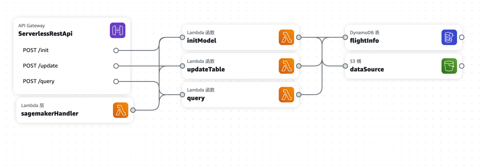

# serverless-sagemaker-trigger

> **提示：** 原型项目仅供参考使用，部署生产环境请谨慎。

> **提示：** 当前项目尚未包括sagemaker endpoint的调用逻辑，sagemaker handler中有对应方法的空实现。


## Introduction
本项目基于AWS Serverless Application Model构建的无服务器架构的应用程序，实现了一个简单的创建，调用和管理机票航班预测推理模型功能。
需要运行本项目，确保您系统中已经安装以下组件：
- [Create an AWS account](https://portal.aws.amazon.com/gp/aws/developer/registration/index.html) if you do not already have one and log in. The IAM user that you use must have sufficient permissions to make necessary AWS service calls and manage AWS resources.
- [AWS CLI](https://docs.aws.amazon.com/cli/latest/userguide/install-cliv2.html) installed and configured
- [Git Installed](https://git-scm.com/book/en/v2/Getting-Started-Installing-Git)
- [AWS Serverless Application Model](https://docs.aws.amazon.com/serverless-application-model/latest/developerguide/serverless-sam-cli-install.html) (AWS SAM) installed

## Architecture


### 本架构业务中分成4个主要的层次：
- [API Gateway]() 用来管理restful api的组件
- [Lambda]() 用来运行主要业务逻辑的云函数
- [DynamoDB]() 用来存放航班预测信息的数据库
- [S3]() 用来存放生成航班预测模型的基础数据信息

## Code Structure
- initModel: 用来初始化预测推理模型的函数，理论上每个航班只需调用一次
- updateTable: 用来更新航班预测信息的函数，它有2中调用场景，第一种是每分钟业务测从gds获取更新的航司信息后调用，第二种是有用户在平台下订单的时候主动触发调用，第二种调用的时候需传递下订单时精确的时间戳，updateTable程序会自动查询到这个时间戳之前最近一条记录并覆盖更新。
- query: 调用sagemaker endpoint获取模型预测的航班结果
- sagemakerHandle：一个lambda layer，可以被不同的lambda引用，这里主要提供了sagemaker对应的调用接口，如更新推理模型，以及查询模型预测等

## Test
使用 sam deploy --guided 命令部署本应用程序后，会在命令行出现API Gateway部署好的Endpoint URL，将其替换到下面的参考测试脚本中即可实现测试。

- 初始化推理模型：
```shell
curl -X POST https://cpgrlqv2a9.execute-api.ap-southeast-1.amazonaws.com/Prod/init -H 'Content-Type: application/json' -d '{"flight_id": "1001"}'    
```
success response:
```shell
"Initialization successfully"
```